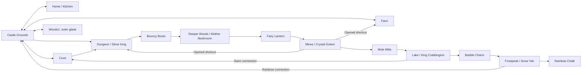

# Claude implementation brief — Tidecrown metroidvania redesign

Prepared October 10, 2026. This is an implementation specification for the existing Unity project, not a request to build a new game. Read this document in full before editing. Implement the phases in order and report evidence for each acceptance gate.

## Assignment

Make Tidecrown’s existing world more interconnected and make traversal-tool acquisition meaningfully change accessible routes. Preserve its gentle, readable adventure, both playable heroes, existing bosses, quests, saves, home interactions and controller support.

Implement on top of the current working tree. Do not reset, discard, stash or overwrite unrelated work. Read applicable repository instructions before editing. Inspect Git status and identify ongoing changes. Recheck the content inventory: this project changed while its documentation was being written.

Start with these references:

- [Zone access audit](ZONE_ACCESS-2026-10-10.md): latest documented graph, including Frostpeak.
- [Earlier state snapshot](CURRENT_STATE-2026-10-10.md): useful system inventory, but its 18-scene counts predate Frostpeak.
- [Polish roadmap](../ROADMAP.md): usability/reliability priorities; some expansion statuses also predate Frostpeak.
- [Maps](../Assets/Levels), [scene builder](../Assets/Editor/DungeonBuilder.Levels.cs), [map parser](../Assets/Scripts/MapFile.cs), [validator](../Assets/Scripts/MapValidator.cs), [tests](../Assets/Tests).

At the documented baseline there are 22 playable maps, including Frost1–4, and five traversal treasures: Bouncy Boots, Fairy Lantern, Mole Mitts, Bubble Charm and Rainbow Chalk. Confirm the latest state instead of restoring an older snapshot.

The specification below is the default product decision. Make routine implementation choices autonomously. If physical layouts require a different endpoint for a proposed shortcut, select a nearby existing room, document why, and preserve its progression dependencies. Do not change the main dependency order, remove existing content, or invent a final region to satisfy this assignment.

## Product requirements

### Required experience

1. The player sees a meaningful blocked route before acquiring the tool that opens it.
2. Every traversal tool opens a main route or meaningful continuation, a useful connection, and at least one optional discovery. Existing discoveries count if readable and reachable.
3. The world has at least three new cross-region connections, creating loops rather than only out-and-back branches.
4. Outer Woods, Farm, Cove and Home remain accessible early. Deeper progression follows boots → lantern → mitts → charm → chalk; side quests remain optional.
5. Both Wizard and Princess complete the same routes. No learned combat skill, consumable, money, Hat/Helm or dialogue choice gates required traversal.
6. Tool gates are recognizable world obstacles with picture prompts. Avoid unexplained invisible barriers and “you must finish quest X” text locks.
7. Shortcuts remain opened across travel and restart. Required progress cannot be lost through a full bag, skipping dialogue, returning later or an interrupted session.
8. Preserve all existing obtainable rewards. Relocate only if necessary, retaining stable identity or migrating its saved state.
9. Give the current adventure an interconnected traversal structure without adding Storm Spire, a final boss or a new campaign ending.

### Explicit non-goals

Do not implement co-op, new heroes, a combat/skill-tree redesign, procedural maps, a replacement save system, new inventory currencies, large new regions or a new navigation package. Reuse existing grid navigation, map authoring, item possession checks and generated art workflow. A small connector scene is a last resort and must have a concrete layout justification.

## Target progression graph

This is the required fresh-save dependency structure. Arrows here show progression intent; the route manifest below specifies direction and prerequisites.

Retain the current Castle Grounds all-monsters check for its Dungeon stairs and Cove’s combat-gated alternative entrance unless testing proves a real blocker. The existing Dungeon → hub boss guard remains. New shortcuts should make that structure less repetitive without opening deeper progression early.

## Required route manifest

Give every gate and shortcut a stable semantic ID, independent of placement. The IDs here describe intended content; adapt spelling to repository conventions consistently.

| ID | Endpoint A ↔ endpoint B | First access / requirement | Return behavior and purpose |
|---|---|---|---|
| `route_woods_depth` | Woods1 ↔ Woods2 | Bouncy Boots; put a short gap on the approach, leaving Woods1, Old Moss and its fountain reachable early | Tool remains required; opening deeper Woods is the first main traversal payoff |
| `route_mines_entrance` | Woods3 ↔ Mines1 | Fairy Lantern reveals an obscured tunnel entrance; make the route unavailable before possession rather than merely dark | Lantern is permanent, so discovered passage remains usable; sightline/hint should explain the missing light |
| `route_dungeon_lake` | Dungeon ↔ Lake1 | Mole Mitts excavate collapsed passage; replace the currently ungated Lake entrance with a visible soil/rubble gate | Excavation is saved; both arrival sides stay on safe land |
| `shortcut_mines_dungeon` | Mines3 ↔ Dungeon | Mole Mitts and first excavation from Mines side | Permanent return loop; Dungeon side cannot open it early; land near a useful main corridor, outside egg/wand chambers |
| `shortcut_mines_farm` | Mines2 ↔ Farm | Mole Mitts and first excavation from Mines side | Permanent link to familiar early region; Farm cannot bypass Lantern to enter Mines |
| `shortcut_lake_cove` | Lake2 ↔ Cove | Bubble Charm; reachable from shore by swimming | Both directions require swim approach; Lake boss/charm cannot be bypassed via Cove before acquisition |
| `route_frost_approach` | Lake3 ↔ Frost1 | Preserve existing Bubble Charm swimming approach | Validate the return landing and fountain discovery; no extra fishing/scarf requirement |
| `shortcut_frost_castle` | Frost3 ↔ Level0 | Rainbow Chalk, draw a bridge on the approach; show its castle-side posts early | Persistent bridge; castle side must not allow early Frost access; useful late-game return |
| `shortcut_dungeon_woods` | Dungeon ↔ Woods2 | Bouncy Boots; first release a latch from Woods side | Shortens return after exploring deeper Woods; no early route from Dungeon bypassing the boots gate |

Eight named routes above are new/changed; the ninth preserves an existing physical gate. Implement all manifest entries unless one cannot fit coherently in existing geometry; then document a same-dependency substitution. Keep the main chain intact.

Do not create scene transitions across unspecified empty world space. Each endpoint needs an authored, readable approach and a safe spawn. Prefer enlarging a side pocket or repurposing blank wall space to moving entire maps. Never put a shortcut arrival behind another unrelated lock.

### Tool payoff checklist

| Tool | Required continuation | Connection payoff | Optional payoff |
|---|---|---|---|
| Boots | Woods1 → Woods2 | Woods2 → Dungeon latch shortcut | Existing Level0 garden / Dungeon egg or shard |
| Lantern | Woods3 → Mines1 | The opened Mines access links a new region to Woods | Add a small revealed alcove in Woods3 with an existing reward type; darkness alone is not the optional unlock |
| Mitts | Dungeon → Lake1 | Mines → Dungeon and Mines → Farm | Existing buried treasures and Mines egg |
| Charm | Lake3 → Frost1 | Lake2 ↔ Cove swimming route | Existing lake/cove islands and Lake egg |
| Chalk | Meaningful late-game continuation: access Castle-side rainbow overlook/link | Frost3 ↔ Castle | Existing Frost egg/heart and Lake2 chasm shard |

There is no final region in scope. Do not fabricate a mandatory Chalk campaign gate or claim Chalk completes a campaign. Its late-game continuation must be a real traversable connection with a satisfying discovery and return, using existing reward types.

## Gate and shortcut implementation requirements

### Reuse existing behavior

Inspect before extending:

- `Abilities.Has(itemId)` and treasure possession for tool checks.
- `HopAbility`, `Gap`, `LanternLight`, `PushBlock`, `SoftDirt`, `SwimAbility`, `RainbowPost` and `RainbowBridge` for physical obstacles.
- `SceneDoor`, `RoomEdge`, `ExitZone` and named spawns for scene movement.
- `Condition`, `GameSession.Flags`, `MarkUsed` and `SaveSystem` for persistent state.
- `HintBubble`, `WorldMapData`, `WorldMapView` and builder world-map generation for discovered obstacles.

### Minimal new behavior

- Add a reusable, persistent shortcut latch/excavation controller only where existing components cannot express one-side opening.
- Add a Lantern-revealed passage that visibly responds to possession and whose collision/transition availability agrees with its visual state. No combat damage interaction or Light component intensity heuristic should decide permission.
- Centralize route eligibility so interaction prompt, physical blockers, transition activation, map status and tests agree. If physical geometry enforces a gate, record that dependency in route metadata too.
- A one-side latch requires the correct side/approach, the specified tool where applicable, and an explicit interaction. Nearness to its far side must not unlock it accidentally.
- Closed passages must refuse direct transition activation as well as block normal walking. Include `SceneDoor.Interact` and `RoomEdge.Cross` paths in the design; do not let a hidden trigger bypass its obstacle.
- Preserve base behavior for legacy ungated door/edge definitions. Optional requirement metadata must default to unrestricted.
- Keep map syntax declarative and documented. If adding arguments or a dedicated route section, update parser, validator, builder, runtime serialization and examples together. Do not silently reinterpret existing destination/spawn arguments.
- Extend validation for known tool IDs, unique gate IDs, endpoint consistency, required flags and named spawns. Only intentional one-way routes may lack a reciprocal transition; flag accidental missing returns.
- Opening a route must update collision, visuals, hints and navigation promptly. Mark the grid dirty where needed. Persist before a subsequent scene transition and save critical unlocks at a safe arrival location.

### Discovery and navigation

For every main tool gate, provide a discoverable obstacle icon before unlock, a correct tool picture, and a brief success cue afterward. Store discovery separately from unlock. Map markers should distinguish unknown, discovered blocked, available and permanently opened routes without revealing unexplored destinations prematurely.

After receiving each tool, suggest one previously discovered use. Do not force a long dialogue tutorial. Optional Gentle Mode tracking may point toward the required gate; support muted play and both input devices. Do not rely on red/green alone.

## Preventing bypasses and soft locks

- Treat fountains and carts as edges in the progression graph. Fountain destinations unlock only through actual contact, not mere scene visits or an authored starting flag.
- Fresh saves must not obtain `fountain:Mines1`, `fountain:Lake1` or `fountain:Frost1` before their legitimate access. Never auto-register an inaccessible destination to simplify testing.
- Once legitimately discovered, fountain travel remains an allowed shortcut. Do not remove the network just to enforce backtracking.
- Preserve Digby’s cart requirement `thanked:digby` and its Mines1 → Mines2 → Mines3 → Mines1 loop. Required Mines progression must not depend on this optional quest.
- Prevent the new Cove swimming connection from giving pre-Mitts access to Lake or pre-Charm access through a dry shore route.
- Place one-side shortcuts so the early endpoint cannot be reached by a gap hop, collision bypass or an interaction through the wall. Check both characters and camera/input approaches.
- Opening/closing menus, recovery, entering from another route and reloading must not leave the hero inside the blocker or cause immediate reverse-transition loops.
- Do not require pushing a block irreversibly to enter a mandatory region. Use excavation, a resettable arrangement or a guaranteed reset.
- Tool rewards remain permanent treasures and do not consume bag capacity. Keep rewards collectible if the player leaves immediately after boss defeat.
- Separate scene-wide clearing from individual route permission. A `cleared:<Scene>` flag must not satisfy an unrelated tool gate.

## Existing-save compatibility

Before changing maps, document how old saves identify pickups, doors, buried treasures and bridges. Much current content uses `scene/col,row` persistent IDs. Moving rows/columns can duplicate collected treasures or transfer used state to the wrong object.

Required behavior:

1. Existing compatible saves load with inventory, levels, skills, quests and discovered fountains intact.
2. Preserve authored persistent IDs and original tile coordinates where feasible. If relocating content, assign stable IDs and migrate old IDs explicitly; never mark all objects in a room collected as a shortcut.
3. New routes use semantic IDs from the start. Do not change item IDs or reorder equipment enum values.
4. Old saves already inside newly gated regions must have a safe exit. Use a conservative migration that records previously accessed regions/permits return or maps unsafe spawns to a safe point. Do not remove tools, delete saves, force boss replay or automatically award unearned tools.
5. If a legacy access exception is necessary, scope it to those saves and document it. Fresh saves must follow the target graph. Already touched fountains may remain valid legacy return routes.
6. Version migrations should be idempotent and tested using isolated fixtures; preserve previous files/backups. Clear flags are not a substitute for knowing whether a region was visited.

## Development phases

### Phase 0 — baseline and route design

Read source, instructions and current status. Run the existing map validation and relevant baseline tests if the Unity environment allows it. Record failures without labeling them caused by this work prematurely.

Deliver a route manifest with exact map endpoints, approach sketches/tile coordinates, requirement IDs and arrival spawn names. Identify existing pickup coordinates affected by layout changes. Review the graph for fountain/cart bypasses and the placement of boss reward sources.

**Acceptance:** all endpoints refer to existing scenes; all required tools are obtainable before their gates; early areas remain reachable; the full fresh-save chain has no circular dependency. Commit/record this design before broad map edits when repository workflow permits.

### Phase 1 — route framework and compatibility

Implement minimum conditional-transition/one-side unlock behavior, semantic persistence, map syntax/validation, collision/navigation updates and migration infrastructure. Add focused tests for actual new behavior.

**Acceptance:** a sample gate refuses entry without its tool, opens correctly from the intended side, survives restart, and preserves ordinary door/edge behavior. A sample old save loads safely. No unrelated scene rebuild churn is accepted without explanation.

### Phase 2 — first metroidvania loop

Implement Woods1 → Woods2 Boots gate, Woods3 → Mines1 Lantern passage, and Dungeon ↔ Woods2 far-side latch. Add Lantern’s optional revealed alcove and discovered-gate hints. Keep outer Woods accessible.

**Acceptance:** a fresh player can see the boots obstacle, get boots from Slime King, reach Mother Mushroom, acquire Lantern, enter Mines and open a useful return route. Both heroes complete it. Neither old entry nor a new shortcut bypasses the first two gates.

### Phase 3 — Mitts progression and cross-region loops

Gate Dungeon → Lake1 with excavation; add Mines3 ↔ Dungeon and Mines2 ↔ Farm far-side excavations. Preserve ordinary Mines movement and cart behavior. Tune shortcut lengths so they save meaningful travel rather than lead to nearly identical nearby positions.

**Acceptance:** Crystal Golem is reachable with Lantern and without Mitts; its reward opens Lake and both cross-region links. Farm/Cove cannot bypass the gates on fresh saves. All shortcuts remain usable after reload and cannot strand players.

### Phase 4 — swimming and rainbow connections

Add Lake2 ↔ Cove swim route; validate existing Lake3 → Frost1 swim gate; add Frost3 ↔ Castle rainbow link. Preserve the Frost scarf trade and current Chalk-gated local treasures.

**Acceptance:** Crabbington is reachable without Charm, Yeti without Chalk. Charm unlocks Frost and the Cove route. Chalk opens a visually satisfying hub loop. Unsafe swimming spawns and early Castle → Frost bypasses are impossible under normal controls.

### Phase 5 — guidance, pacing and regression

Finish map markers and tool-acquisition reminders. Update relevant NPC directions and quest descriptions to match changed routes. Shorten repeated explanation and remove stale “just walk there” guidance. Rebuild generated scenes/prefabs/world-map data through the supported builder, retaining assets and metadata needed for a clean checkout.

**Acceptance:** complete the fresh-save route with both heroes; test old saves, alternate entrances, recovery and all fast travel. Run relevant regression tests and a standalone smoke test. Update zone-access documentation with the implemented graph, including substitutions. Report exactly what was run and any environment limitation.

## Verification requirements

Use real map/layout reachability as well as component tests; passing a predicate test does not prove that a player cannot walk around a gate. Build a small explicit progression/reachability model or fixture for the route manifest, with tool acquisition sources and discovered fast-travel edges. Check it against authored geometry and validate in Play Mode.

| Case | Required outcome |
|---|---|
| Fresh hero, no traversal tools | Home/Kitchen, Farm, Cove and outer Woods reachable; deeper Woods/Mines/Lake/Frost gated |
| Boots only | Deeper Woods and Mother Mushroom reachable; Mines and Lake unavailable |
| Boots + Lantern | Golem/Mines reachable; Lake unavailable |
| Add Mitts | Lake/Crabbington reachable; new excavations persist; Frost unavailable |
| Add Charm | Frost/Yeti reachable; Lake–Cove link usable; rainbow connection unavailable |
| Add Chalk | All specified routes and Chalk pockets reachable |
| Early endpoint of each one-side shortcut | Cannot open or activate transition before legitimate far-side unlock |
| Full bag / boss reward left behind | No required treasure lost or blocked; returning/reloading preserves reward |
| Save/reload after gate discovery/open | Map status, visuals, collision, nav and permission agree |
| Old save inside newly gated room | Safe recovery and exit; no stripped progress or unsolicited tool grants |
| Fountains and carts | No fresh-save sequence bypass; legitimately discovered travel remains available |
| Wizard and Princess; keyboard/controller | Same progression; correct prompts; no input leaks or inaccessible interactions |
| Gentle death/recovery; Adventurer retry | Safe arrival; no placement inside blocker; no progress regression |
| Map rebuild | Same route IDs/permissions; compatible saved IDs; no missing scene/spawn references |

Existing suites to inspect/reuse include MapFileTests, GatesTests, LevelFlowTests, PersistenceTests, SaveTests, GamepadTests, GentleModeTests, MinesTests, LakeTests and Frost tests if present. Add tests for irreversible progression, migrations and new interactions rather than duplicating trivial implementation details.

## Completion and Claude handoff report

The assignment is complete when every required route is implemented or replaced by a documented equivalent, the main dependency chain and at least three new cross-region loops are verified, existing saves have a tested compatibility path, and both heroes can finish the existing traversal progression.

Return:

- Final implemented connection graph and route manifest.
- Changed files and why; distinguish authored changes from generated output.
- Tool-by-tool main/shortcut/optional payoff list.
- Save compatibility/migration details and fixtures tested.
- Automated results and manual/standalone routes actually exercised.
- Known limitations, any substituted endpoints and remaining polish work.

Do not claim runtime validation when only source inspection or graph checks were possible. Keep unrelated current work intact and leave a concrete, reviewable implementation.
