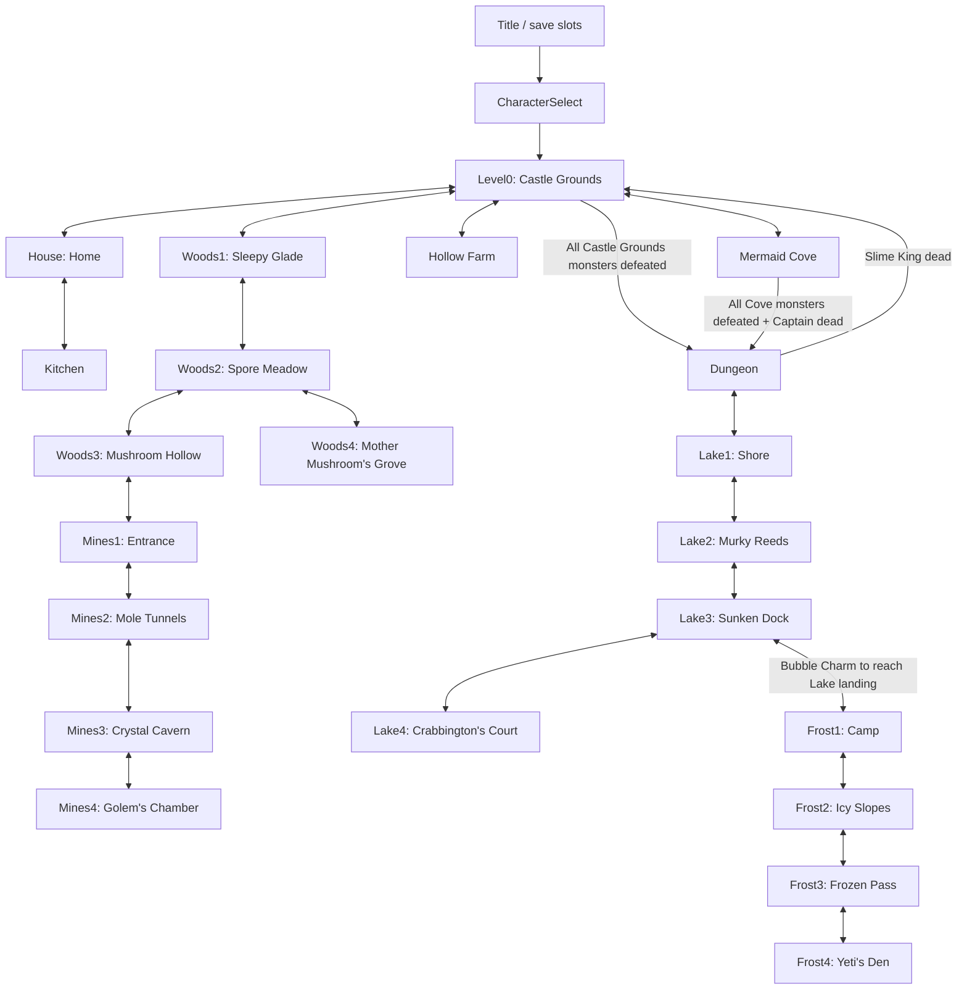
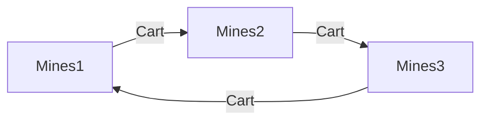

# Tidecrown — zone connections and access dependencies

Audited **October 10, 2026**, against the current working tree. This document maps the **22 existing playable scenes** and their entrances, exits, shortcuts and internal gated areas. It supplements the [current-state snapshot](CURRENT_STATE-2026-10-10.md). **Frostpeak content appeared in the working tree during this audit; this document includes it and is newer than the earlier 18-scene snapshot.**

The map below describes actual declared transitions and code/serialized entrance checks, rather than the intended order in the original roadmap. Map links were cross-checked against saved scene destinations and exit settings. Physical reachability through every room has not been verified by a fresh Unity playthrough; “no entrance requirement” means no tool/quest/combat check on that transition, not that the route is safe or free of enemies.

## Connection map

Solid two-way arrows indicate ordinary reciprocal routes with no progression check on the transition. Single arrows are directional routes; their labels identify the requirements. Fast travel is documented separately below. The Lake3–Frost1 route has no condition on its transition component, but reaching the Lake3 landing requires swimming with the Bubble Charm.

Continue loads the scene/spawn recorded in the selected save, rather than forcing this new-game route. CharacterSelect also has a Back route to Title. Neither menu is counted among the 18 playable scenes.

## Every existing level: how to enter and leave

“None” below means no progression requirement on that particular scene transition. Walking through an edge opening triggers travel; doors, boats, gates and spiral stairs use Interact. Crystal exits trigger travel when entered and open.

| Destination / scene ID | Can be entered from | Entrance location or method | Entrance dependencies | Routes leaving this scene |
|---|---|---|---|---|
| **Castle Grounds** — `Level0` | CharacterSelect, House, Cove, Farm, Woods1, Dungeon | New-game spawn; home door; pond rowboat; farm gate; woodland edge; Dungeon return stairs | None from menus/House/Cove/Farm/Woods1. From Dungeon: Slime King must be dead | House, Cove, Farm, Woods1 freely; Dungeon stairs require Castle Grounds clear |
| **Home** — `House` | Level0, Kitchen | Castle gate from grounds; spiral stairs up from Kitchen | None | Level0 through front door; Kitchen down spiral stairs |
| **Kitchen** — `Kitchen` | House | Spiral stairs down | None | House through spiral stairs up |
| **Mermaid Cove** — `Cove` | Level0 | Rowboat beside Coralie’s pond | None; no need to meet Coralie/Pearl or finish frog quest | Level0 by boat freely; Dungeon through gated sea-cave exit |
| **Hollow Farm** — `Farm` | Level0 | Gate in southern hedge | None; no need to meet Old Stitches/Pippin | Level0 by same gate; Pumpkin King does not gate the return |
| **Dungeon** — `Dungeon` | Level0, Cove, Lake1 | Castle Grounds crystal stairs; Cove sea-cave secret stairs; Lake shore opening | From Level0: all Grounds monsters defeated or remembered `cleared:Level0`. From Cove: all Cove monsters defeated/remembered clear **and** Captain guardian dead. From Lake1: no transition check | Level0 through Slime-King-gated crystal stairs; Lake1 through south opening. No direct exit back to Cove |
| **Sleepy Glade** — `Woods1` | Level0, Woods2 | Castle Grounds west hedge opening; reciprocal meadow opening | None; Bouncy Boots not required for region entry | Level0 and Woods2 freely |
| **Spore Meadow** — `Woods2` | Woods1, Woods3, Woods4 | Reciprocal room-edge openings | None; waking trees or speaking to Old Moss is not an entry check | Woods1, Woods3 and Woods4 freely |
| **Mushroom Hollow** — `Woods3` | Woods2, Mines1 | South branch from meadow; reciprocal Mines entrance | None; Fairy Lantern strongly helps visibility but is not an entrance lock | Woods2 and Mines1 freely |
| **Mother Mushroom’s Grove** — `Woods4` | Woods2 | Meadow branch to boss grove | None; tree quest/Old Moss thanks not required to enter | Woods2 freely; boss reward depends on Mother Mushroom defeat |
| **Mines Entrance** — `Mines1` | Woods3, Mines2 | Hollow south opening; reciprocal tunnel opening | None; Lantern and Mole Mitts not required by entrance code | Woods3 and Mines2 freely; additional cart route after Digby thanks |
| **Mole Tunnels** — `Mines2` | Mines1, Mines3 | Reciprocal tunnel openings | None; Lantern helps the dark tunnels, but no Lantern check | Mines1 and Mines3 freely; additional cart route after Digby thanks |
| **Crystal Cavern** — `Mines3` | Mines2, Mines4 | Reciprocal cavern openings | None; Mitts are for optional internal treasure gates | Mines2 and Mines4 freely; additional cart route after Digby thanks |
| **Golem’s Chamber** — `Mines4` | Mines3 | Cavern opening to boss room | None; finding moles, Digby thanks and owning Mitts not required to enter | Mines3 freely; Golem defeat reveals Mitts/Topaz |
| **Lake Shore** — `Lake1` | Dungeon, Lake2 | Crack/opening in Dungeon south wall; reciprocal reed-bank opening | None; Slime King defeat and Bubble Charm are not transition checks | Dungeon and Lake2 freely |
| **Murky Reeds** — `Lake2` | Lake1, Lake3 | Reciprocal bank openings | None; Bubble Charm needed for islands, not entry | Lake1 and Lake3 freely |
| **Sunken Dock** — `Lake3` | Lake2, Lake4, Frost1 | Reciprocal shoreline openings; Frostpeak landing in northeast pond | No transition checks. Entering from Frost1 arrives at the landing; Bubble Charm needed to swim between landing and main shore | Lake2 and Lake4 freely; Frost1 via swimming route |
| **Crabbington’s Court** — `Lake4` | Lake3 | Opening and plank bridge across moat | None; fishing quest/Fishing Rod/Bubble Charm not required to enter | Lake3 freely; King defeat reveals Charm/Aquamarine |
| **Frostpeak Camp** — `Frost1` | Lake3, Frost2 | Lake3 northeast pond landing; reciprocal slope opening | From Lake3: Bubble Charm to reach the landing across water (physical gate, no flag check on edge). From Frost2: none | Lake3 at south opening; Frost2 freely; fountain travel after discovery |
| **Icy Slopes** — `Frost2` | Frost1, Frost3 | Reciprocal room-edge openings | None; ice changes movement, not permission | Frost1 and Frost3 freely |
| **Frozen Pass** — `Frost3` | Frost2, Frost4 | Reciprocal room-edge openings | None; Rainbow Chalk is for the egg side pocket | Frost2 and Frost4 freely |
| **Yeti’s Den** — `Frost4` | Frost3 | Pass opening to icy boss room | None; scarf trade, Chalk and Sapphire not required to enter | Frost3 freely; Snow Yeti defeat reveals Chalk/Sapphire |

### The three combat-gated scene transitions

| Route | Exact enforced logic | What is not required |
|---|---|---|
| Level0 → Dungeon | `requireAllEnemiesDefeated: 1`, no guardian. Open when no living registered enemies remain, or `cleared:Level0` is remembered | Amethyra introduction, Amethyst, Bouncy Boots, frog quest |
| Cove → Dungeon | `requireAllEnemiesDefeated: 1` plus Captain guardian. All-enemies condition can use remembered `cleared:Cove`; guardian must also be dead/destroyed | Speaking to Pearl or receiving her thanks; Seashell Mail |
| Dungeon → Level0 | `requireAllEnemiesDefeated: 0` plus Slime King guardian. King must be dead/destroyed; other enemies need not all be defeated | Picking up Amethyst/boots, returning a gem, collecting an egg, all-monsters clear |

These requirements apply to the **route leaving the source scene**, not to the destination globally. In particular, Cove is an alternate way into Dungeon without clearing Level0. Dungeon’s Lake edge has no Slime King guard check. Boat/gate/edge routes out of Level0 remain available before its Dungeon stairs unlock.

## Fast-travel dependencies

### Fountain network

The existing destinations are **Level0, Woods1, Mines1, Lake1 and Frost1**. Each has a fountain marker in its playable map.

- Approach a fountain to register `fountain:<Scene>`; simply visiting the scene is insufficient.
- Open the fountain travel menu while within range of a fountain and while the hero can act.
- The destination must have been touched previously. Current-scene destinations are omitted; Rest Here is a separate option.
- No gem, boss, traversal tool, gold cost or quest completion is checked for the trip.
- Travel arrives at the named `Fountain` spawn and saves the destination.
- Once registered, these links bypass intervening rooms and their exit gates. For example, Dungeon → Lake1 → a previously touched Level0 fountain provides an alternate return to the hub without using Dungeon’s Slime-King-gated stairs.

Frost1 is now present as a map, saved scene and enabled build entry, and is included in the fountain network. Touching its fountain makes future returns possible without repeating the swimming approach.

### Mine-cart shortcut

The cart runs this **one-direction loop**, not a destination-selection menu. All three stations require `thanked:digby`: find **Mo, Mortimer and Molly** (three lost moles), then return to Digby and finish his reward conversation. Finding three moles without receiving his thanks does not unlock it. Arrival uses the `Cart` spawn. No Mitts, Golem clear or fare is checked. Mines4 has no cart station; reach it on foot from Mines3. Ordinary walking connections remain available while the cart is locked.

## Areas inside levels and their dependencies

These are subareas, not additional loadable scenes. A requirement here must not be mistaken for a requirement to enter the surrounding level.

| Scene / subarea | Access from | Actual dependency | What is there / important distinction |
|---|---|---|---|
| Level0 — Hollyhock village | Paths within Castle Grounds | No progression lock identified | Barnaby, shop frontage, cathedral/cottage, coop and square; buildings are not separate enterable scenes |
| Level0 — Amethyra’s cave | South opening of rocky hill in northeast grounds | No quest/tool lock identified | Dragon dialogue and gem/egg acknowledgements |
| Level0 — camp and woods | Paths within grounds | No progression lock identified | Trailblazer Boots and healing campfire |
| Level0 — bramble nook | Behind starting area, southwest | Hit bramble with either hero’s spell | Chest; no later traversal tool needed |
| Level0 — secret garden | Southeast, across gap | Bouncy Boots | Heart piece |
| Dungeon — storeroom / ordinary doors | Main room/corridors | Interact to open ordinary doors; no key requirement | Barrels/crates and route toward treasure room |
| Dungeon — locked treasure room | Corridor past storeroom | Rusty Key flag `key:rusty`, found elsewhere in Dungeon | Starlight Wand; this key opens an internal door, not a region |
| Dungeon — upper gap alcove | Gap above early corridor | Bouncy Boots; one-tile hop | Star shard |
| Dungeon — egg chamber | East wall of Slime King hall | Bouncy Boots; two-tile hop | Amethyst Dragon Egg; obtaining boots itself depends on King defeat |
| Dungeon — mushroom-grotto reward | Grotto off puddle hall | Activate both braziers with spells | Hidden star shard; room entry itself is not locked |
| Dungeon — Dad’s Workshop | Fake wall in start room’s east wall | Walk through fake wall; no ability needed | Desk/note and star shard; hidden from map until discovered |
| Cove — sea cave | Beach path into northeast cave | No separate tool/key lock identified for cave entry | Seashell Mail/chest/treasure; **transition to Dungeon** is separately combat-gated |
| Cove — small sea island | Swim west of beach | Bubble Charm | Heart piece |
| Farm — festival and corn maze | Through festival arch/path within Farm | No quest or traversal-tool lock identified | Cider stand, activities, maze-center Pumpkin Hat; maze navigation is the challenge |
| Farm — graveyard | Opening in fence | No quest/tool check identified | Pumpkin King; no new level transition |
| House — bathroom/courtyard | Open interior doorways | No progression lock identified | Bath, fixtures, Whiskers and well |
| House — old locked courtyard door | Far end of courtyard path | **Unavailable:** fixture has no working key or scene destination | Not an entrance to an existing hidden scene; Rusty Key does not open it |
| Woods1 — buried-heart spot | Loose soil within glade | Mole Mitts to dig | Heart piece |
| Woods2 — buried-shard spot | Loose soil within meadow | Mole Mitts to dig | Star shard |
| Woods3 — dark hollow/chest | Branch from Woods2 | No explicit Lantern gate; Lantern improves visibility | Chest/food and route to Mines |
| Mines1 — heavy-block corridor | Corridor within entrance | Mole Mitts to push block | Heart piece |
| Mines1 — buried shard / plugged chest passage | Soil mound / soil plug | Mole Mitts to dig | Star shard / chest |
| Mines2 — mole side chambers | Dark tunnel branches | No Mitts or quest-completion lock identified; Lantern helps visibility | Mo, Mortimer, Molly; their rescues unlock cart after Digby return |
| Mines2 — buried-heart spot | Soil mound in side pocket | Mole Mitts | Heart piece |
| Mines3 — egg chamber | Narrow block-plugged corridor | Mole Mitts to push block | Topaz Dragon Egg |
| Mines3 — buried-heart / pet-rock secret | Soil mound / plugged side room | Mole Mitts to dig | Heart piece / pet rock |
| Lake1 — offshore treasure islands | From docks/banks | Bubble Charm | Heart piece and star shard |
| Lake2 — central egg island and smaller islands | Swim from banks | Bubble Charm | Aquamarine Dragon Egg, heart piece and star shard |
| Lake3 — pond islands | Swim from dock/banks | Bubble Charm | Chest and heart piece |
| Lake3 — Frostpeak landing | Swim across northeast pond | Bubble Charm | Edge to Frost1; this is a physical region-entry gate |
| Lake2 — chasm pocket | Rainbow posts in southwest | Rainbow Chalk from Snow Yeti; interact with a post | Star shard; independent of swimming islands |
| Frost1 — camp, Mr. Frost and Granny Purl | Ordinary paths within Camp | No scarf/quest lock | Yarn → Granny’s scarf → Mr. Frost reward is a trade chain, not an entrance prerequisite |
| Frost1 — chasm pocket | Rainbow posts in northwest | Rainbow Chalk | Heart piece |
| Frost2 — icy field / snow island | Walk onto ice | No tool required; movement slides | Star shard |
| Frost3 — egg pocket | Rainbow posts in northeast | Rainbow Chalk | Sapphire Dragon Egg |
| Frost4 — icy den | Main route from Frost3 | No ice-traversal tool or scarf required | Snow Yeti and hidden Chalk/Sapphire rewards |

The Castle Grounds crystals disappear when `has:amethyst` is true. This is a restoration condition, not a scene-entry permission; it does not require the return conversation to Amethyra.

## What the dependency structure means

- **Woods and Mines can be explored early.** No Bouncy Boots requirement is attached to the Level0 → Woods1 edge. No Fairy Lantern requirement is attached to Woods3 → Mines1. Darkness and combat are practical challenges, not explicit item checks.
- **Lake does not require swimming to enter or reach its boss.** Bubble Charm is the boss reward used afterward for island treasures. Fishing Lesson helps rewards/guidance but does not authorize access to the Court.
- **Boss quests guide the player rather than grant boss-room entry.** Trees, moles and fishing objectives gate subsequent quest-log entries or rewards/shortcuts; their respective boss-room edges do not check those objectives. The Frostpeak scarf trade likewise does not gate the Yeti’s Den.
- **No hero-specific entrance lock was found.** Both heroes get the traversal treasures and can clear spell gates with their starting element. Learned combat skills are not entrance prerequisites.
- **Most traversal tools gate optional local exploration.** The current region graph is more flexible than a strict boots → lantern → mitts → charm campaign sequence. Frostpeak is the important exception: its approach from Lake3 is physically gated by Bubble Charm swimming; Rainbow Chalk then opens return treasures in Frostpeak and Lake2.
- **Several connections are asymmetric.** Cove → Dungeon has no direct reciprocal Dungeon → Cove link. Dungeon’s hub stairs are boss-gated, but its Lake route is reciprocal and ungated.

## Coverage and source references

Inventory: 22 maps and 24 enabled build scenes (including Title/CharacterSelect). Scene links were checked in [saved scenes](../Assets/Scenes) alongside [map definitions](../Assets/Levels). Temporary `InitTestScene` artifacts and proposed Storm Spire content are not counted as existing zones.

Access behavior comes from [SceneDoor](../Assets/Scripts/SceneDoor.cs), [RoomEdge](../Assets/Scripts/RoomEdge.cs), [ExitZone](../Assets/Scripts/ExitZone.cs), [builder exit/guardian wiring](../Assets/Editor/DungeonBuilder.Levels.cs), [DungeonDoor](../Assets/Scripts/DungeonDoor.cs), [RainbowPost](../Assets/Scripts/RainbowPost.cs), [RainbowBridge](../Assets/Scripts/RainbowBridge.cs), [courtyard-door fixture](../Assets/Editor/DungeonBuilder.Home.cs), [MineCart](../Assets/Scripts/MineCart.cs), [WakeFountain](../Assets/Scripts/WakeFountain.cs), and [FountainTravelView](../Assets/Scripts/FountainTravelView.cs).

Refresh this document after changing map legends, exit settings, tool gates, fountain destinations or build scenes. A future runtime audit should verify actual no-tool walking routes, spawn safety and alternate exits; the graph alone cannot certify those physical paths.
